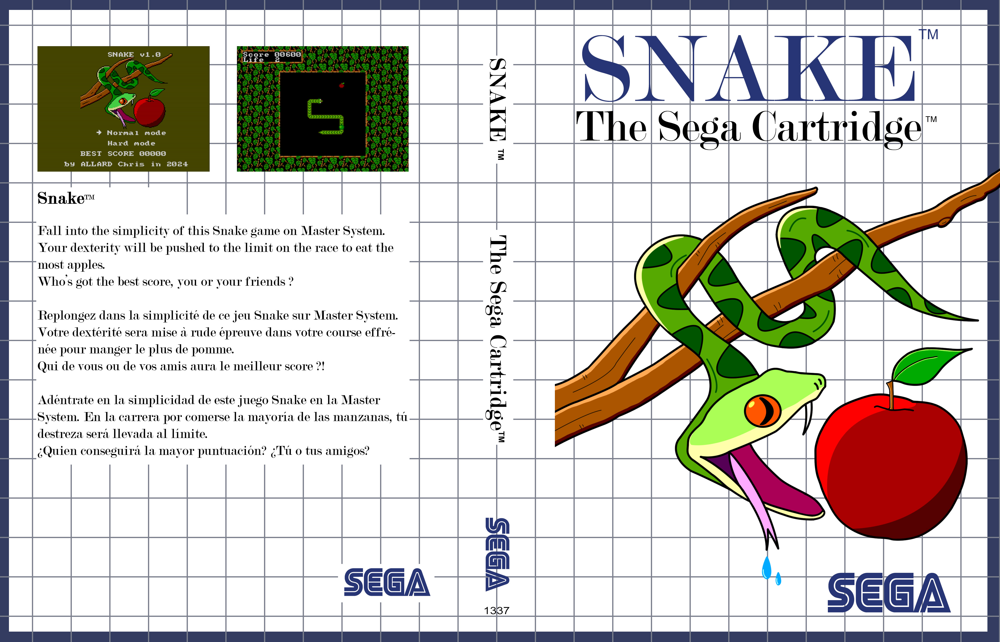

# Description

My first game, developped entirely in assembler, for the Master System (the only 8bit console I own).
The goal was not to make a new game but to port an existing simple gameplay that could be realized without using sprite.
The game is fully functional on real hardware (only tried on SMS 2).

# Links I used during development

[SMSPower](https://www.smspower.org/Development/Index) - The best site for everything to do with the Master System.

[Sonic1-Z80-ASM](https://github.com/Kroc/Sonic1-Z80-ASM) - Very usefull for projet structure and good example of codes.

[Z80 Opcode](https://jnz.dk/z80/opref.html) - Z80 Opcode Reference Charts

[Z80 Optimization](https://wikiti.brandonw.net/index.php?title=Z80_Optimization#Registers_and_Memory)

# Legal

The code is far from perfect and many things can be optimized.
Feel free to use the code and assets if you want to learn too.
But if you make any optimizations or improvements, please make them public and share them with others, by pushing the changes on this repository.

# ToDo
- Add Music and sound.
